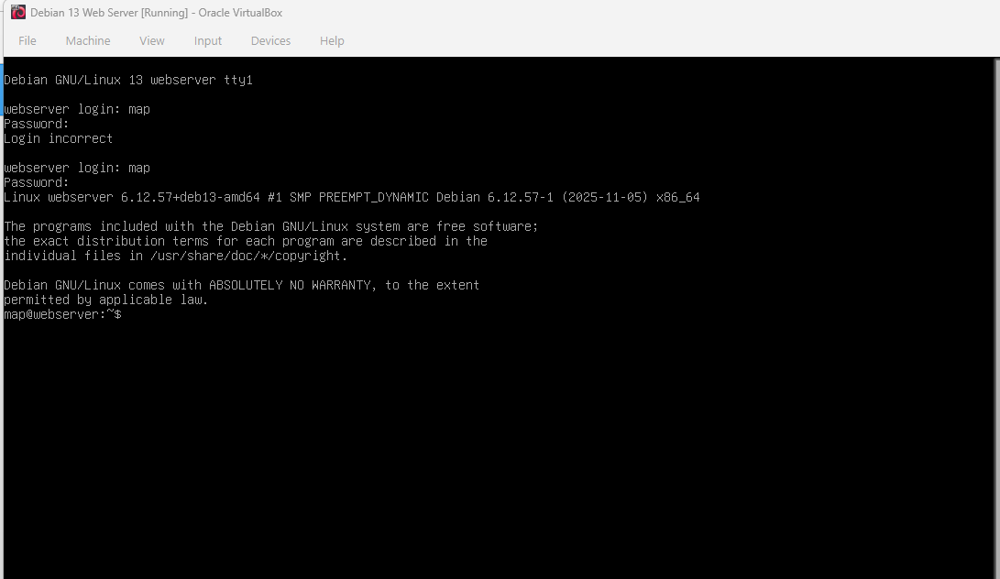
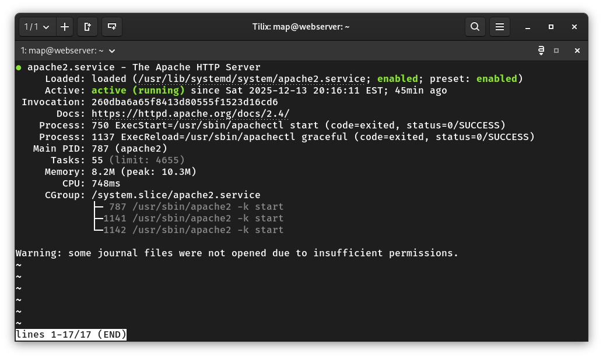
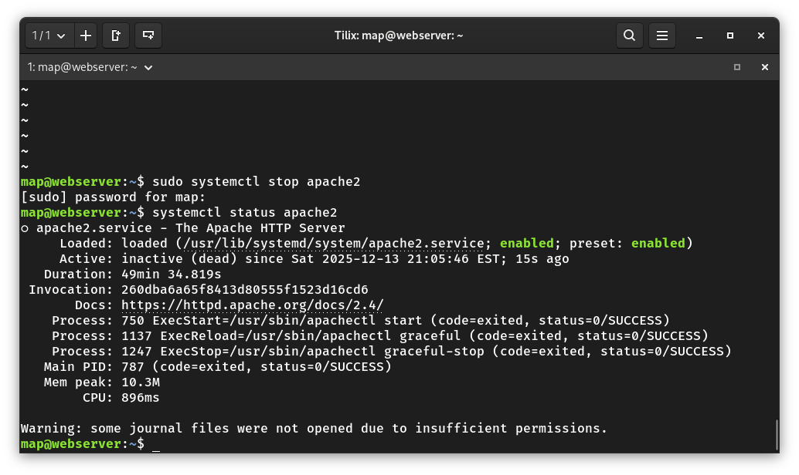
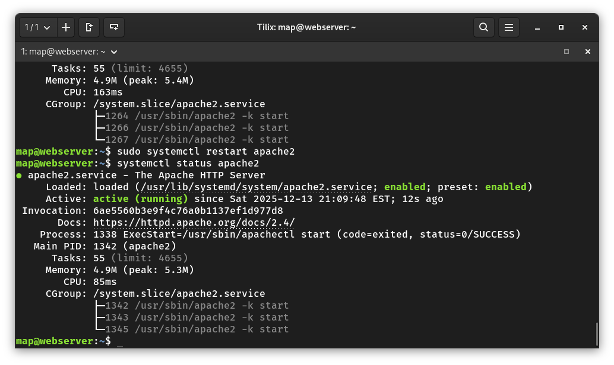
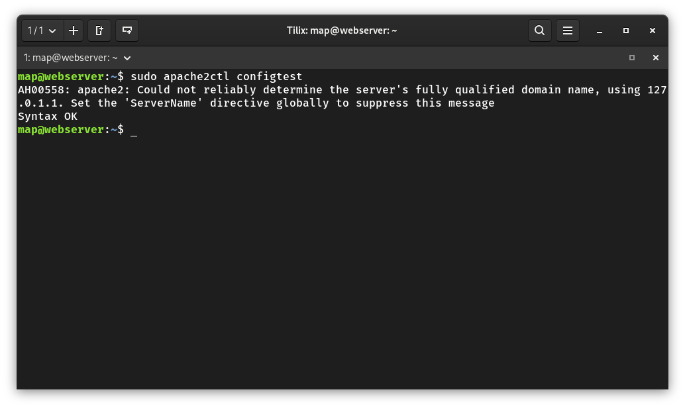
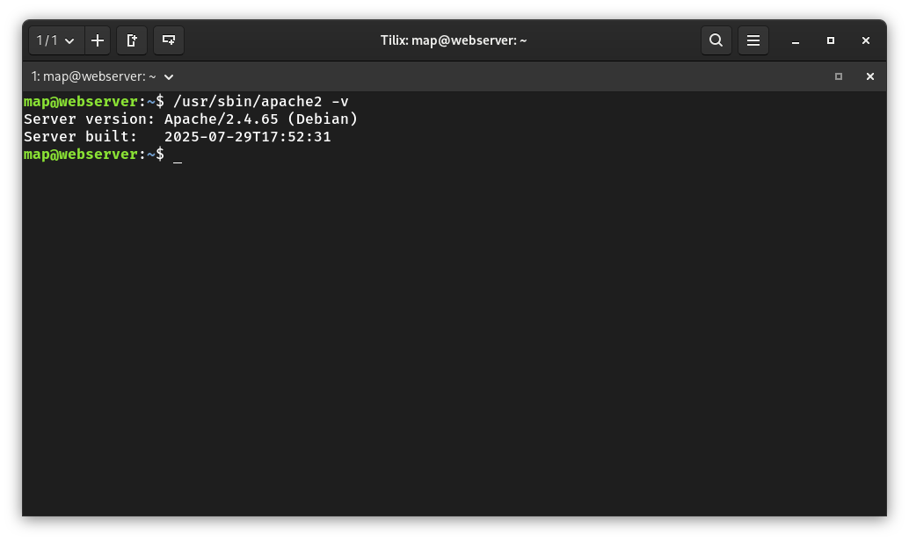
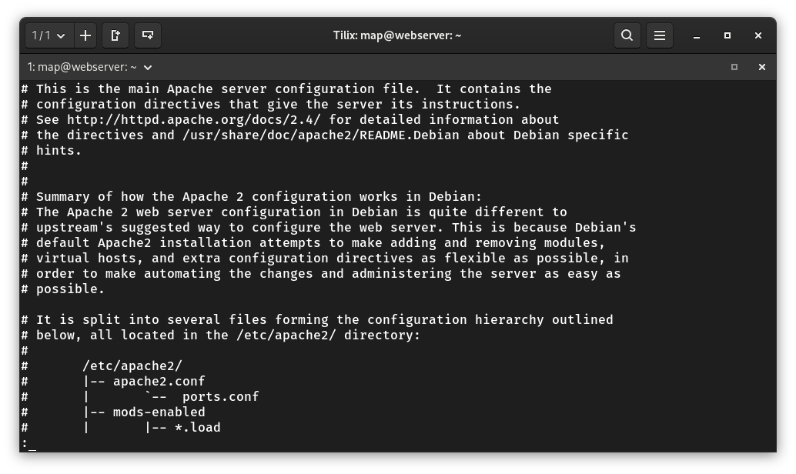
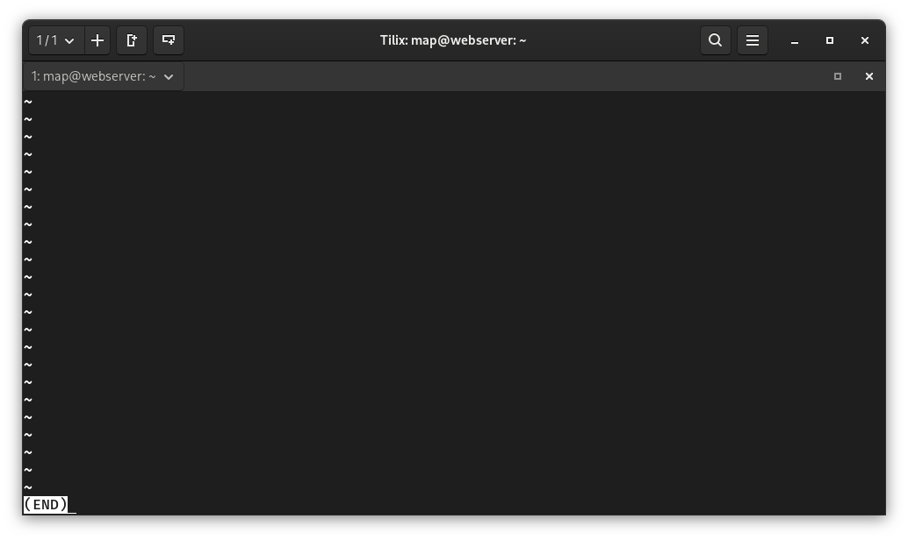

# Deliverable 2
## 1. What are the server hardware specifications (virtual machine settings)?

## 2. What is the Debian Login Screen?

## 3. What is the IP address of your Debian Server Virtual Machine? 

## 4. How do you work with the Firewall in Debian?

### Command name: ufw
* **Description**: ufw is used to manage firewalls rules that control incoming and out going network traffic on a debian system.
* **Formula**/**Syntaxt**: `ufw` + `option` + `argument` 
* **Examples**:
  * How do you check if the Firewall is running?
    * By using the command `systemctl status ufw`
  * How do you disable the Firewall?
    * By using the command `sudo ufw disable`
  * How do you add Apache to the Firewall?
    * By using the command `sudo ufw allow 'WWW Full`

## 5. What different commands do we use to work with Apache?

**1.  What is the command you use to check if Apache is running?**
* The command is: `systemctl status apache2`
* Description:
The systemctl status apache2 command checks the current status of the Apache web server service. It shows whether Apache is running, stopped, or has encountered errors, along with recent log messages and service information.

**2.  What is the command you use to stop Apache?**
* The command is: `sudo systemctl stop apache2`
* Description:
The sudo systemctl stop apache2 command stops the Apache web server service. Once stopped, Apache will no longer accept or respond to web requests until it is started again.

**3.  What is the command you use to restart Apache?**
* The command is: `sudo systemctl restart apache2`
* Description:
The sudo systemctl restart apache2 command restarts the Apache web server service. 

**4.  What is the command used to test Apache configuration?**
* The command is: `sudo apache2ctl configtest`
* Description:
The sudo apache2ctl configtest command checks Apache configuration files for syntax errors. It verifies that the configuration is valid before restarting Apache and helps prevent the service from failing due to misconfiguration.

**5.  What is the command used to check the installed version of Apache?**
* The command is: `/usr/sbin/apache2 -v`
* Description:
The /usr/sbin/apache2 -v command displays the installed version of the Apache web server, including the version number and build information.

**6.  What are some common configuration files for Apache?**
* The command is: `sudo less /etc/apache2/apache2.conf`
* Description:
The sudo less /etc/apache2/apache2.conf command opens the main Apache configuration file in read-only mode, allowing the administrator to view and review Apache settings without modifying the file.

**7.  Where does Apache store logs?**
* The command is: `sudo less /var/log/apache2/access.log`
* Description:
The sudo less /var/log/apache2/access.log command opens the Apache access log file, which records client requests, accessed resources, and response status codes for the Apache web server.

**8.  What are some basic commands we can use to review logs?**
* The command is: `cat` 'less' 'head''tail'
* Description:
The commands cat, less, head, and tail are commonly used to review log files. They allow an administrator to view the entire file, scroll through large logs, or display the beginning and end of a log file for quick inspection.
\
