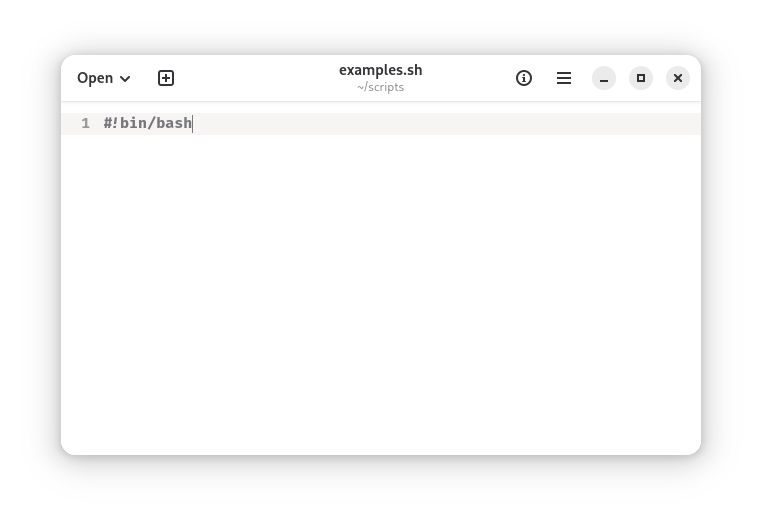
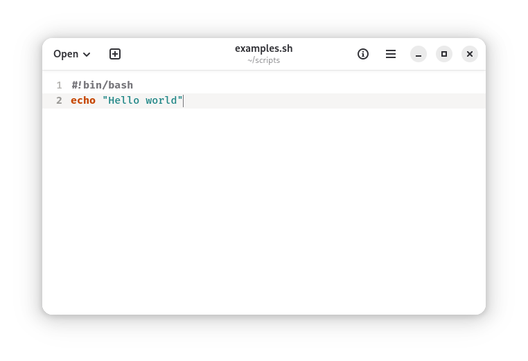
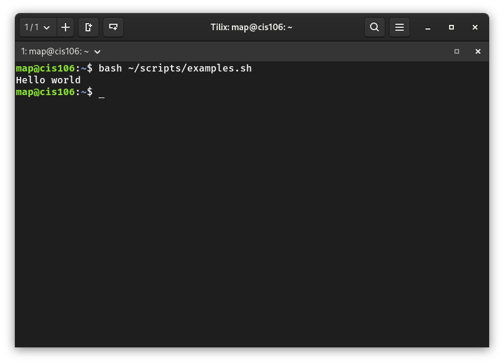

# Notes 4

## How to install and remove software using the APT command
To install software using APT, you type sudo apt install package_name, which downloads and installs the program from trusted repositories. Before installing, it’s a good idea to update your package list with sudo apt update so you get the latest version. To remove software, you type sudo apt remove package_name, which deletes the program but keeps its settings. If you want to completely erase it, you use sudo apt purge package_name to remove both the program and its configuration files.

## How to create a shell script

### step 1 Create fill

### step 2 Add shell decleration

### step 3 Run script

