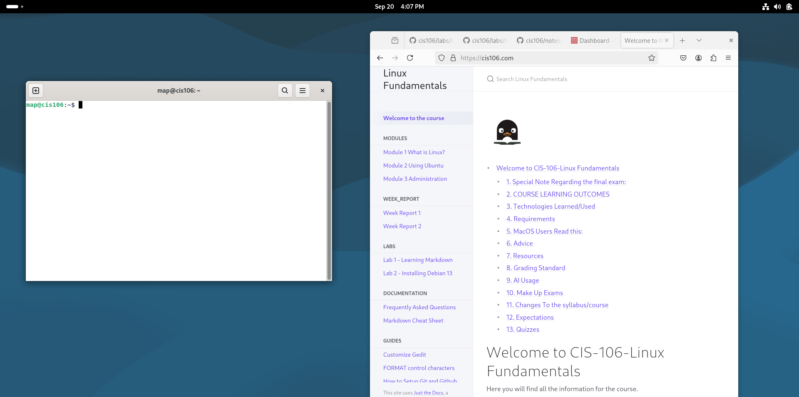

# Week Report 2

## Alternative 1 using local file path
* [Notes 2](../../notes/notes2/notes2.md)
* [Lab 2](../../labs/labs2/labs.md)

## Alternative 2 using the github url
* [Notes 2](https://github.com/mponce38/cis106/blob/main/notes/notes2/notes2.md)
* [Lab 2](https://github.com/mponce38/cis106/blob/main/labs/lab2/lab2.md)

## Debian Desktop
